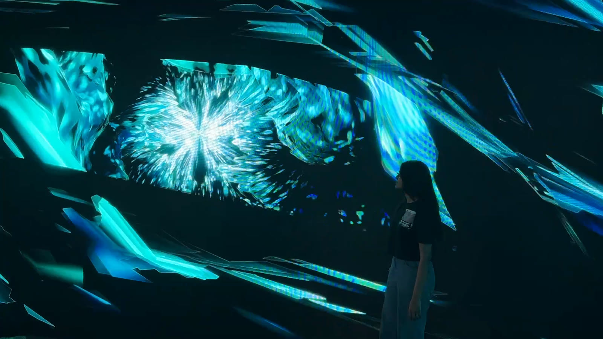
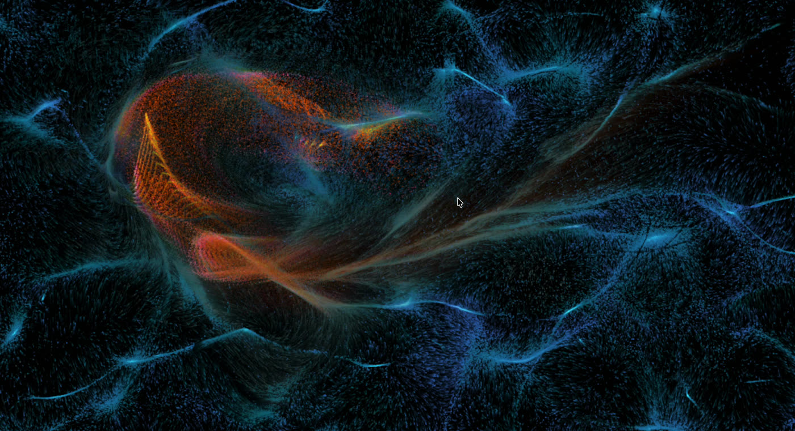
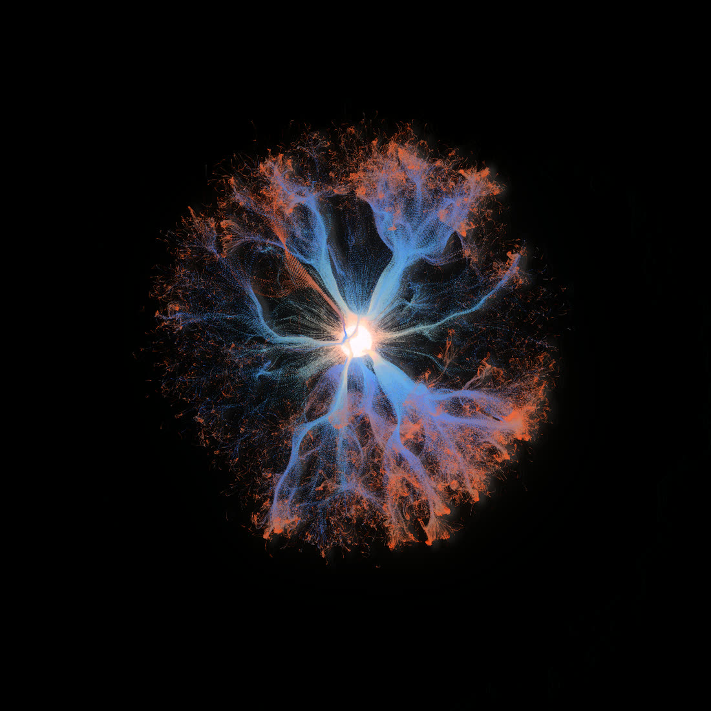

# Sowmya Reddy Sangem

**TouchDesigner developer & interactive visual artist** · Hyderabad, India

Portfolio: **https://sowmyareddysangem.github.io**

I build real-time systems in TouchDesigner that respond to the world around them. Touch, gesture, sound, cameras, sensors, and live data become structure, color, and motion, shaped in the moment.



## Works

### 01 · Nature's Intelligence
*Workshop piece, The Node Institute × Sixth Sense Festival, Bangalore*

A live audio-visual piece made during a TouchDesigner workshop led by Bileam Tschepe at the Sixth Sense Festival, under the theme *Nature's Intelligence*. It explores water and the fine line between its calm and its violence: crystal-like forms grow, fracture and settle again, never quite repeating.

One continuously evolving texture drives the surface, light and color of the whole piece in real time.

### 02 · Ember and Ease
*Continuous input*



A cursor-reactive flow field about passion and the momentum it creates. At rest the field drifts, cool and calm. Move through it and the particles you reach gather energy and burn amber, then cool back to quiet.

Around 409,600 particles are simulated live in TouchDesigner. Pointer movement feeds an optical-flow feedback loop that pushes the particles, and their color shifts from cool to amber as they gain energy.

### 03 · Kindle
*Discrete input*



A click-triggered study. Each click stamps an origin point, and a particle structure blooms outward and holds until the next click, the way the brain lays down a new path where none existed before.

Built as a TouchDesigner network, with the burst generated in a GLSL TOP driven by the sampled click position. A feedback loop, blur, emboss and a five-step bloom build up the trail and the raised, glowing edges.

## The lab, ongoing

Studies from a personal archive of TouchDesigner experiments.

| No. | Study | Input | Mode |
|---|---|---|---|
| 01 | LiDAR Particles | LiDAR point cloud | Particles |
| 02 | Phone-Driven Particles | Phone LiDAR depth, gyro & motion (via ZIG-SIM) | Particles |
| 03 | Hand Tracking | MediaPipe | Gesture control |
| 04 | Organic Growth / Tunnel | Recursive rules | Generative form |
| 05 | Procedural Terrain | GLSL | Heightfields |
| 06 | Anamorphic Projection | Perspective correction | Projection |
| 07 | Fulldome / Immersive Room | Dome & room mapping | Immersive |

## Tools

TouchDesigner · GLSL

## Contact

- Email: srus4724@gmail.com
- Phone: +91 7993664707
- Based in Hyderabad, available for freelance: installations, exhibitions, live visuals

---

### About this repository

A single-page static site: `index.html` plus the `media/` folder, with no build step. Hosted on GitHub Pages.

To run it locally, start a server from this folder and open http://localhost:8000:

```
python3 -m http.server 8000
```
